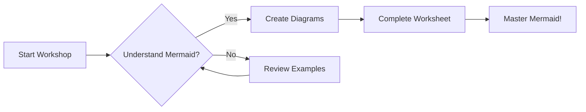

# Mermaid.js Workshop
Current verstion of gitlabs mermaid render:
```mermaid
info 
```

## Quick Links

- 📖 [Mermaid Documentation](https://mermaid.js.org/)
- 🎮 [Mermaid Live Editor (Playground)](https://mermaid.live)
- 📚 [Mermaid Syntax Reference](https://mermaid.js.org/intro/syntax-reference.html)

## About This Project

This workshop is designed to teach developers how to use Mermaid.js for creating diagrams as code in GitHub and GitLab projects. Mermaid allows you to generate diagrams and flowcharts from text definitions, making it easy to version control your documentation alongside your code.

## Objectives

By the end of this workshop, you will be able to:

- ✅ Understand what Mermaid.js is and why it's useful
- ✅ Create basic flowcharts to represent processes and workflows
- ✅ Design sequence diagrams to show interactions between systems
- ✅ Build class diagrams to model object-oriented structures
- ✅ Integrate Mermaid diagrams into your GitHub/GitLab documentation
- ✅ Use the Mermaid Live Editor for testing and prototyping diagrams

## Repository Structure

```
mermaid-workshop/
├── examples/           # Example diagrams for reference
│   ├── basic_flowchart.md
│   ├── basic_classDiagram.md
│   └── basic_sequenceDiagram.md
├── workshop/          # Workshop materials
│   ├── presentation.md
│   └── worksheet.md
└── README.md         # This file
```

## Getting Started

1. **Review the Examples**: Start by exploring the example diagrams in the `examples/` directory
2. **Read the Presentation**: Go through `workshop/presentation.md` to understand Mermaid concepts
3. **Complete the Worksheet**: Practice creating diagrams using `workshop/worksheet.md`
4. **Experiment**: Use the [Mermaid Live Editor](https://mermaid.live) to test your own diagrams

## Why Mermaid?

- **Version Control Friendly**: Diagrams are text-based and work seamlessly with Git
- **No Special Tools Needed**: Works natively in GitHub and GitLab Markdown files
- **Easy to Maintain**: Update diagrams alongside your code changes
- **Multiple Diagram Types**: Supports flowcharts, sequence diagrams, class diagrams, state diagrams, ERDs, Gantt charts, and more
- **Active Community**: Well-maintained with extensive documentation

## Example Diagram

Here's a quick example of what Mermaid can do:



## Resources

- **Official Documentation**: [mermaid.js.org](https://mermaid.js.org/)
- **Live Editor**: [mermaid.live](https://mermaid.live)
- **GitHub Integration**: Mermaid works natively in GitHub Markdown
- **GitLab Integration**: Mermaid works natively in GitLab Markdown

## Contributing

Feel free to add more examples or improve the workshop materials! Create a pull request with your suggestions.

## License

This workshop is provided as-is for educational purposes.
