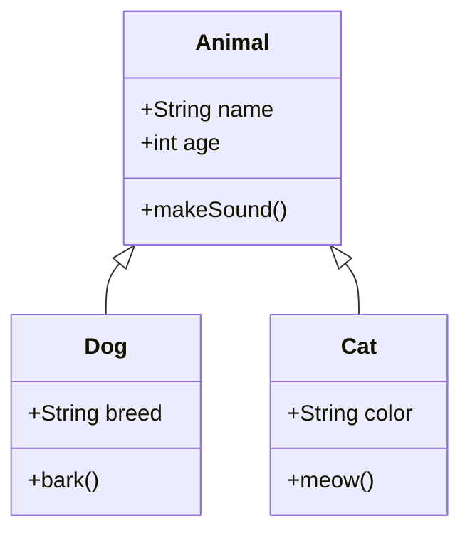
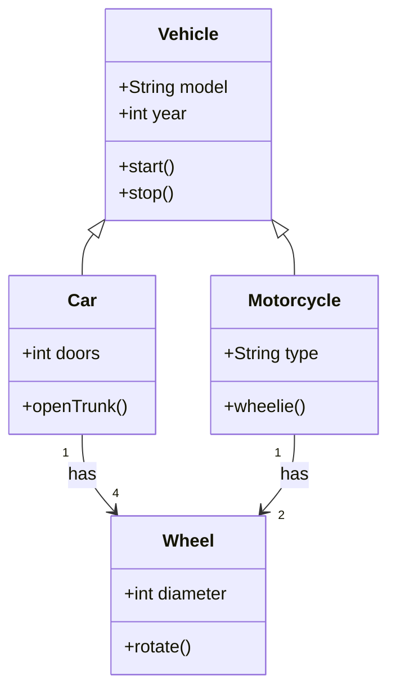

# Basic Class Diagram Example

Class diagrams are used to represent the structure of a system by showing classes, their attributes, methods, and relationships.

## Simple Class Diagram

## Class Diagram with Relationships

## Resources

- [Mermaid Class Diagram Documentation](https://mermaid.js.org/syntax/classDiagram.html)
