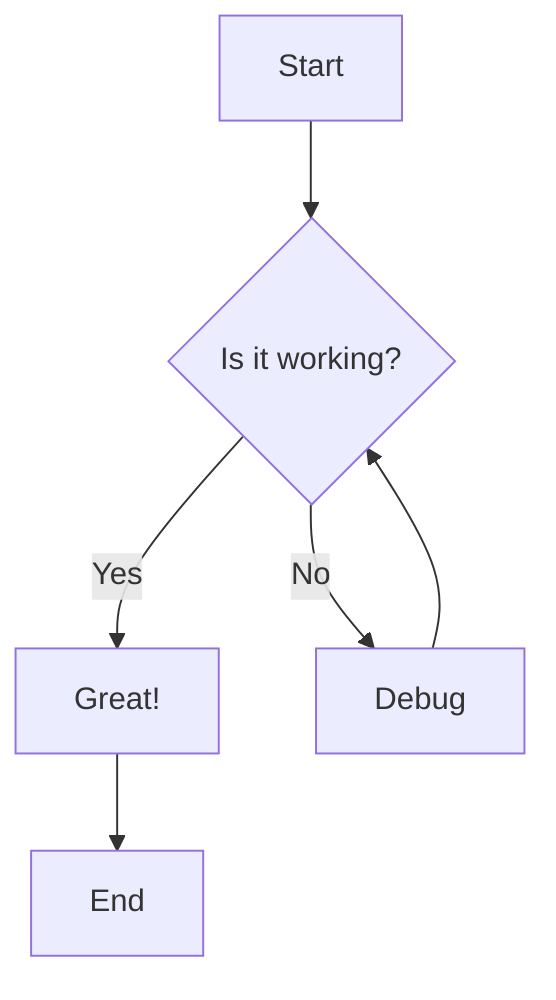
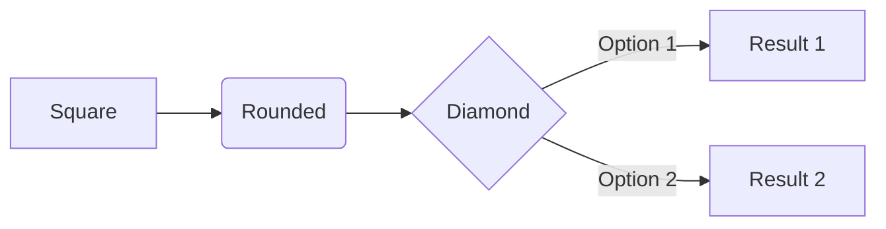

# Basic Flowchart Example

Flowcharts are used to represent workflows or processes. They show steps as boxes of various kinds, and their order by connecting them with arrows.

## Simple Flowchart

## Flowchart with Different Shapes

## Resources

- [Mermaid Flowchart Documentation](https://mermaid.js.org/syntax/flowchart.html)
