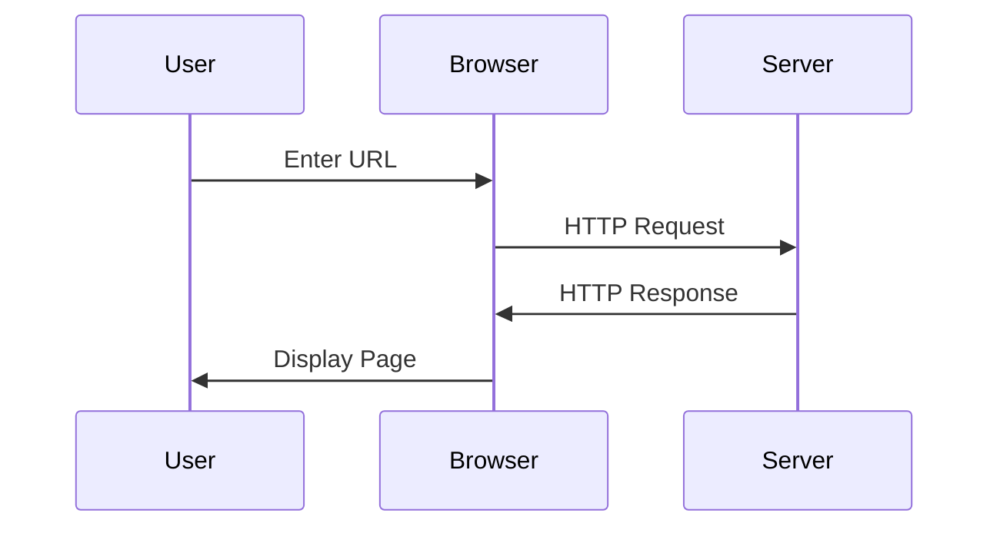
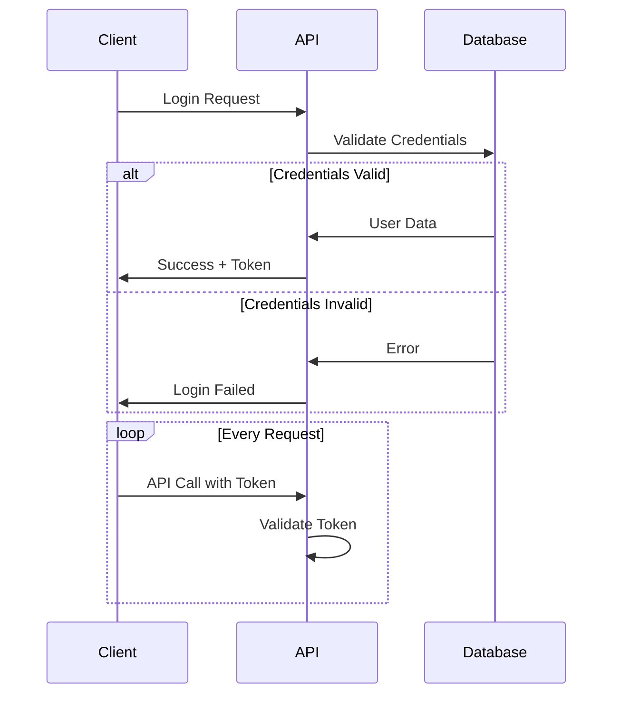

# Basic Sequence Diagram Example

Sequence diagrams show how processes or objects interact with each other over time, displaying the order of messages exchanged.

## Simple Sequence Diagram

## Sequence Diagram with Loops and Conditions

## Resources

- [Mermaid Sequence Diagram Documentation](https://mermaid.js.org/syntax/sequenceDiagram.html)
