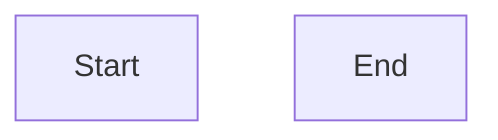
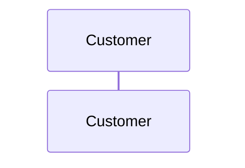

# Mermaid.js Workshop Worksheet

## Exercise 1: Simple Flowchart

Create a flowchart that represents making a cup of coffee. Include at least:
- Start and end points
- A decision point (e.g., "Do you have coffee beans?")
- At least 3 steps in the process



## Exercise 2: Class Diagram

Design a simple class diagram for a library system with:
- A `Book` class with properties (title, author, ISBN)
- A `Member` class with properties (name, memberID)
- A `Library` class that has a relationship with both

```mermaid
classDiagram
    %% Your class diagram here
```

## Exercise 3: Sequence Diagram

Create a sequence diagram showing an online order process:
- Customer places order
- System checks inventory
- Payment is processed
- Order confirmation is sent



## Exercise 4: Your Own Diagram

Think of a process or system from your work or daily life. Create a diagram that represents it using the appropriate diagram type (flowchart, sequence, or class diagram).

### What will you diagram?

_Write a brief description here_

### Your Diagram

```mermaid
%% Your diagram here
```

## Challenge Exercise: Complex Flowchart

Create a flowchart for a user authentication system that includes:
- Login attempt
- Username and password validation
- Two-factor authentication
- Success and failure paths
- Maximum login attempts logic

```mermaid
flowchart TD
    %% Your complex flowchart here
```

## Bonus: Explore Other Diagram Types

Try creating one of these diagram types:

### State Diagram
```mermaid
stateDiagram-v2
    %% Your state diagram here
```

### Entity Relationship Diagram
```mermaid
erDiagram
    %% Your ER diagram here
```

## Resources

- [Mermaid Documentation](https://mermaid.js.org/)
- [Mermaid Live Editor](https://mermaid.live)
- [Flowchart Syntax](https://mermaid.js.org/syntax/flowchart.html)
- [Sequence Diagram Syntax](https://mermaid.js.org/syntax/sequenceDiagram.html)
- [Class Diagram Syntax](https://mermaid.js.org/syntax/classDiagram.html)

## Tips

- Use the Mermaid Live Editor to test your diagrams
- Start simple and add complexity gradually
- Check the examples in the `../examples/` directory for reference
- Use descriptive labels for better readability
